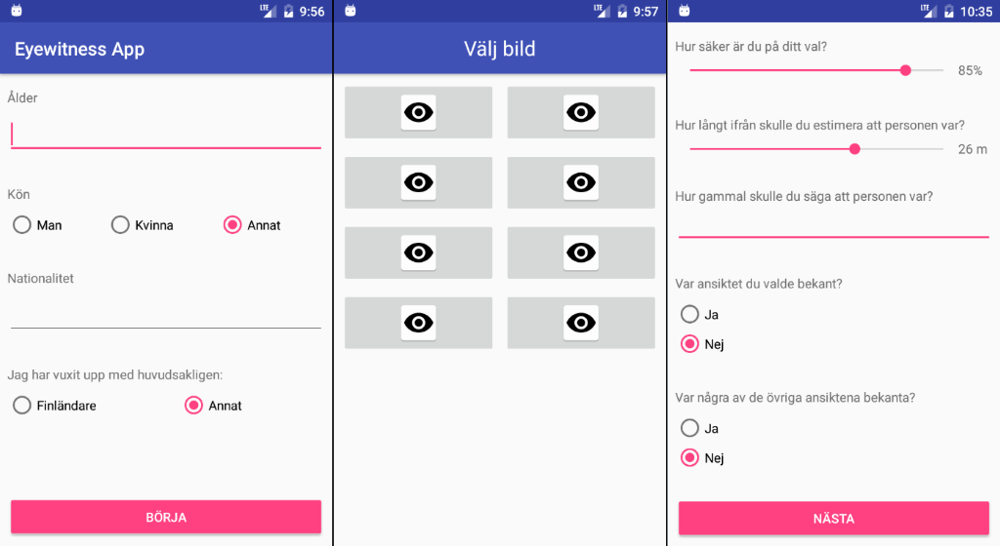

## Screenshot

## TODO
### Features
 - [ ] logging
    - [ ] local
    - [ ] synced
 - [x] Lineup variations
 - [x] Handle backbutton
 - [ ] Logfiles
 - [ ] Settings
### Pages
 - [ ] languages
    - [x] Swedish
    - [ ] English
    - [ ] Finnish
    - [ ] Japaneese
    - [ ] Mandarin
- [x] Testnumber
- [x] Background
- [ ] [eye test](http://www.michaelbach.de/fract/index.html)
- [x] Tutorial
- [x] number selection
- [x] Wait for instructions
- [x] Questions1
- [x] Lineup
- [x] Questions2
- [x] loop to number selection
- [x] Present result (correct identifiactions)